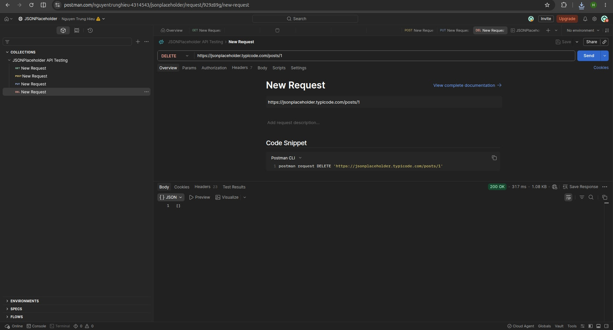
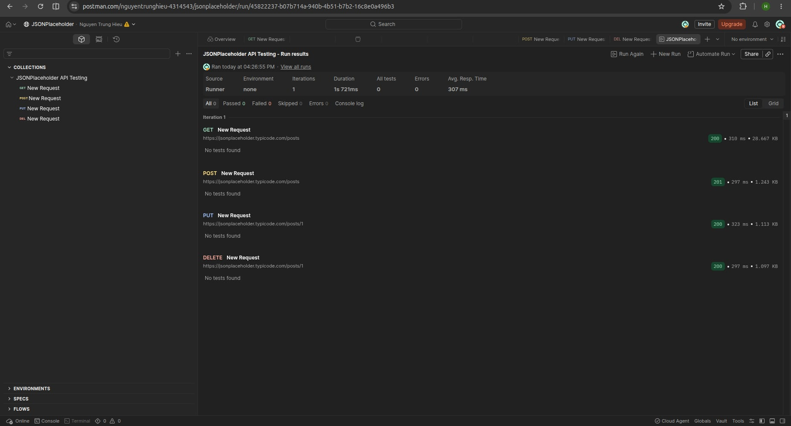

# Báo cáo học Postman - Kiểm thử API

## 1. Giới thiệu

Postman là một công cụ phổ biến giúp gửi các yêu cầu HTTP (GET, POST, PUT, DELETE...) tới một API, xem dữ liệu trả về và viết các đoạn kiểm thử (test script) để tự động kiểm tra xem API có hoạt động đúng như mong đợi không. Khác với việc gọi API bằng trình duyệt hoặc curl, điểm mạnh của Postman nằm ở khả năng tổ chức request thành Collection, quản lý biến môi trường (Environment), và đặc biệt là viết test tự động bằng JavaScript để kiểm tra status code, thời gian phản hồi, nội dung response.

Mục tiêu của bài báo cáo này là thực hành đầy đủ các thao tác cơ bản của Postman: gửi request với 4 phương thức HTTP phổ biến, sử dụng biến môi trường, viết test script kiểm tra kết quả, và chạy toàn bộ Collection bằng Collection Runner.

**Nguồn học:**
- Video hướng dẫn: https://www.youtube.com/watch?v=MFxk5BZulVU

## 2. Công cụ và API sử dụng

- Công cụ: Postman Desktop/Web
- API thử nghiệm: https://jsonplaceholder.typicode.com (REST API giả lập miễn phí, dùng để luyện tập)

## 3. Thiết lập Environment

Tạo một Environment tên `JSONPlaceholder` với biến `base_url` có giá trị `https://jsonplaceholder.typicode.com`. Việc này giúp các request phía dưới dùng `{{base_url}}` thay vì gõ lại URL đầy đủ mỗi lần, và dễ đổi sang môi trường khác (ví dụ staging, production) chỉ bằng cách đổi giá trị biến.

### Hình minh hoạ
<!-- THAY ẢNH THẬT: ảnh chụp màn hình tạo Environment và biến base_url -->


---

## 4. Thực hành GET Request

**Mục đích:** Lấy danh sách bài viết (posts) từ server.

**URL:**
```
GET {{base_url}}/posts
```

**Test Script (tab Tests):**
```javascript
pm.test("Status code is 200", function () {
    pm.response.to.have.status(200);
});

pm.test("Response is an array", function () {
    pm.expect(pm.response.json()).to.be.an("array");
});

pm.test("Response time is less than 1000ms", function () {
    pm.expect(pm.response.responseTime).to.be.below(1000);
});
```

**Kết quả:**
- Status: `200 OK`
- Response trả về danh sách 100 bài viết dạng JSON array
- Cả 3 test case đều Pass

### Hình minh hoạ


---

## 5. Thực hành POST Request

**Mục đích:** Tạo mới một bài viết.

**URL:**
```
POST {{base_url}}/posts
```

**Headers:** `Content-Type: application/json`

**Body (raw JSON):**
```json
{
  "title": "hello",
  "body": "hoc postman",
  "userId": 1
}
```

**Test Script:**
```javascript
pm.test("Status code is 201 Created", function () {
    pm.response.to.have.status(201);
});

pm.test("Response contains an id", function () {
    pm.expect(pm.response.json()).to.have.property("id");
});

pm.test("Title matches request body", function () {
    pm.expect(pm.response.json().title).to.eql("hello");
});
```

**Kết quả:**
- Status: `201 Created`
- Server trả về object vừa tạo kèm `id` mới
- Cả 3 test case đều Pass

### Hình minh hoạ


---

## 6. Thực hành PUT Request

**Mục đích:** Cập nhật toàn bộ nội dung bài viết có `id = 1`.

**URL:**
```
PUT {{base_url}}/posts/1
```

**Body (raw JSON):**
```json
{
  "id": 1,
  "title": "da cap nhat",
  "body": "noi dung moi sau khi sua",
  "userId": 1
}
```

**Test Script:**
```javascript
pm.test("Status code is 200", function () {
    pm.response.to.have.status(200);
});

pm.test("Title was updated", function () {
    pm.expect(pm.response.json().title).to.eql("da cap nhat");
});
```

**Kết quả:**
- Status: `200 OK`
- Dữ liệu trả về khớp với nội dung đã gửi lên

### Hình minh hoạ


---

## 7. Thực hành DELETE Request

**Mục đích:** Xoá bài viết có `id = 1`.

**URL:**
```
DELETE {{base_url}}/posts/1
```

**Test Script:**
```javascript
pm.test("Status code is 200", function () {
    pm.response.to.have.status(200);
});
```

**Kết quả:**
- Status: `200 OK`, server xác nhận đã xoá (response trả về object rỗng `{}`)

### Hình minh hoạ


---

## 8. Chạy toàn bộ Collection (Collection Runner)

Sau khi hoàn thành 4 request trên, toàn bộ được nhóm vào Collection `JSONPlaceholder API Testing` và chạy cùng lúc bằng **Collection Runner** để kiểm tra tự động. Kết quả: tất cả test case ở 4 request đều Pass.

### Hình minh hoạ


---

## 9. Postman Collection

File Collection đã được export và đính kèm trong repo này: [`postman_collection.json`](images/JSONPlaceholder API Testing.postman_collection.json)

Cách import: mở Postman → File → Import → chọn file `postman_collection.json`.

## 10. Kết luận

Qua bài thực hành, đã học và áp dụng được:

- Gửi 4 phương thức HTTP cơ bản: GET, POST, PUT, DELETE
- Gửi Body dạng JSON và thiết lập Header
- Sử dụng Environment và biến (`{{base_url}}`) để tái sử dụng và dễ thay đổi môi trường test
- Viết test script bằng `pm.test()` để tự động kiểm tra status code, dữ liệu trả về và thời gian phản hồi — đây là phần cốt lõi giúp Postman trở thành công cụ *kiểm thử* thực sự, không chỉ là gửi request thủ công
- Chạy đồng thời nhiều request bằng Collection Runner để kiểm thử toàn bộ API một lần

## 11. Tài liệu tham khảo

- Video hướng dẫn: https://www.youtube.com/watch?v=MFxk5BZulVU
