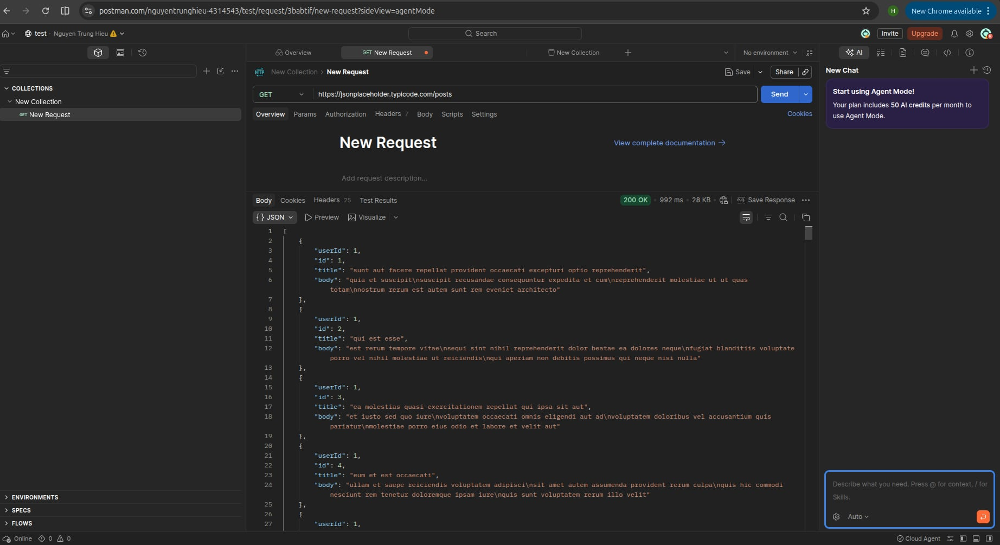
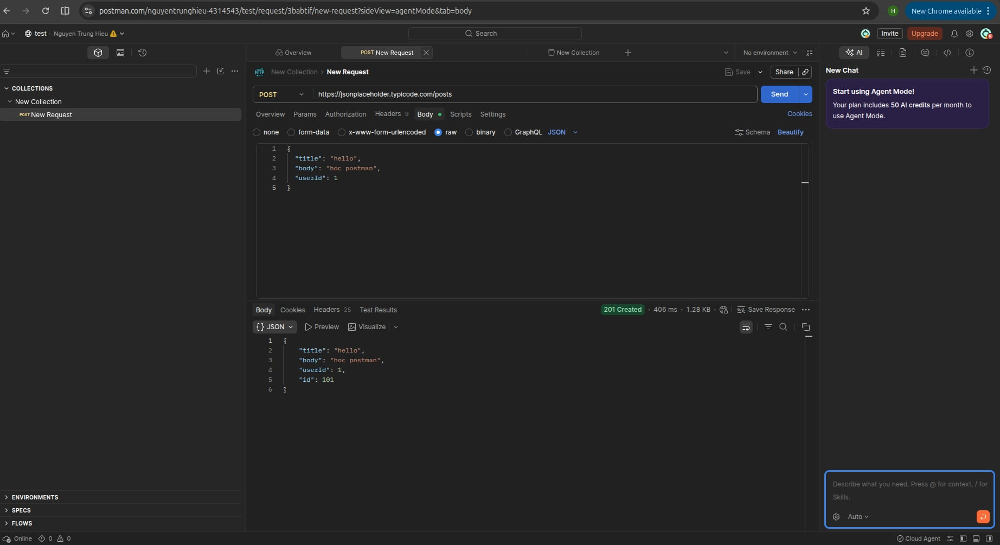

# Báo cáo học Postman

## 1. Giới thiệu
Tìm hiểu công cụ Postman để kiểm thử API.

---

## 2. API sử dụng

https://jsonplaceholder.typicode.com/

---

## 3. Thực hành GET Request

### URL
```txt
https://jsonplaceholder.typicode.com/posts
```

### Kết quả
Đã lấy danh sách bài viết thành công.

### Hình minh hoạ



---

## 4. Thực hành POST Request

### URL
```txt
https://jsonplaceholder.typicode.com/posts
```

### Dữ liệu gửi

```json
{
  "title": "hello",
  "body": "hoc postman",
  "userId": 1
}
```

### Kết quả
Đã gửi dữ liệu thành công.

### Hình minh hoạ



---

## 5. Kết luận

Đã học được:
- GET request
- POST request
- Body JSON
- Kiểm thử API bằng Postman
